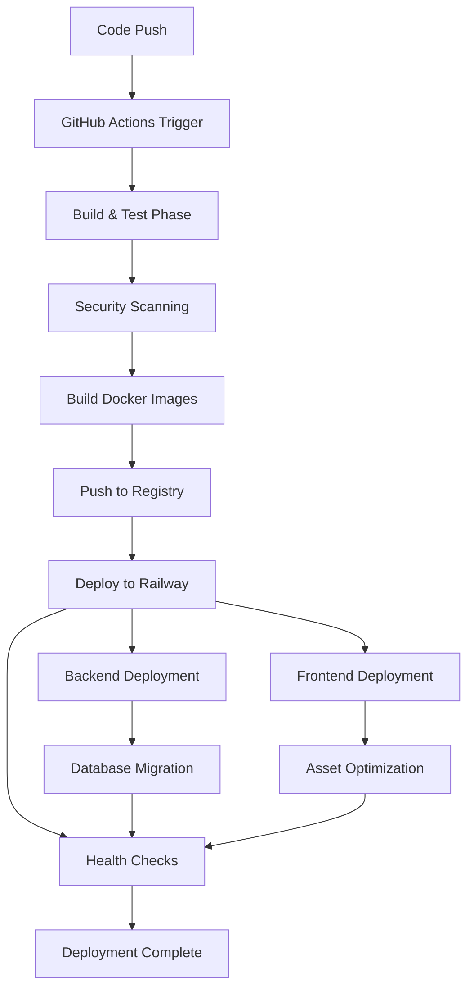

# BrainBytes Comprehensive Deployment Plan

## Table of Contents
1. [Executive Summary](#executive-summary)
2. [Environment Architecture](#environment-architecture)
3. [Resource Specifications](#resource-specifications)
4. [Security Implementation](#security-implementation)
5. [Deployment Procedures](#deployment-procedures)
6. [Testing and Validation](#testing-and-validation)
7. [Operational Procedures](#operational-procedures)
8. [Philippine-Specific Considerations](#philippine-specific-considerations)
9. [Cost Management](#cost-management)
10. [Disaster Recovery and Business Continuity](#disaster-recovery-and-business-continuity)

---

## Executive Summary

The BrainBytes application is deployed using a multi-environment strategy leveraging Railway cloud platform for production deployment and containerized solutions for development and testing. The deployment architecture emphasizes automation, security, and scalability while maintaining cost-effectiveness within free tier limitations.

### Key Deployment Achievements
- **Production Environment**: Successfully deployed on Railway with automatic HTTPS and global CDN
- **CI/CD Pipeline**: Comprehensive GitHub Actions workflow with 9 distinct job phases
- **Multi-Environment Support**: Test, Staging, and Production environments with Docker orchestration
- **Security**: Multi-tool vulnerability scanning with Snyk, OSV Scanner, and Trivy
- **Quality Assurance**: Enhanced ESLint configuration with comprehensive code coverage

---

## Environment Architecture

### 1. Overall Architecture Diagram

```
┌─────────────────────────────────────────────────────────────────┐
│                    GitHub Repository                             │
│  ┌─────────────┐  ┌─────────────┐  ┌─────────────┐             │
│  │   Frontend  │  │   Backend   │  │     E2E     │             │
│  │  (Next.js)  │  │  (Node.js)  │  │   (Jest)    │             │
│  └─────────────┘  └─────────────┘  └─────────────┘             │
└─────────────────────────┬───────────────────────────────────────┘
                          │ Push/PR Triggers
                          ▼
┌─────────────────────────────────────────────────────────────────┐
│                 GitHub Actions CI/CD Pipeline                   │
│  ┌───────┐ ┌───────┐ ┌──────────┐ ┌───────────┐ ┌──────────┐   │
│  │ Test  │ │ Build │ │ Security │ │   E2E     │ │ Deploy   │   │
│  │ & Lint│ │ Images│ │   Scan   │ │ Testing   │ │ Railway  │   │
│  └───────┘ └───────┘ └──────────┘ └───────────┘ └──────────┘   │
└─────────────────────────┬───────────────────────────────────────┘
                          │ Successful Pipeline
                          ▼
┌─────────────────────────────────────────────────────────────────┐
│                   Railway Cloud Platform                        │
│  ┌─────────────────────────────────────────────────────────────┐│
│  │                Production Environment                       ││
│  │  ┌─────────────┐    ┌─────────────┐    ┌─────────────┐     ││
│  │  │  Frontend   │    │   Backend   │    │   MongoDB   │     ││
│  │  │  Service    │    │   Service   │    │   Database  │     ││
│  │  │ (Next.js)   │    │ (Node.js)   │    │ (Railway)   │     ││
│  │  └─────────────┘    └─────────────┘    └─────────────┘     ││
│  │         │                   │                   │          ││
│  │  ┌─────────────────────────────────────────────────────────┐││
│  │  │              Railway Load Balancer & CDN               │││
│  │  │        Automatic HTTPS & Global Distribution           │││
│  │  └─────────────────────────────────────────────────────────┘││
│  └─────────────────────────────────────────────────────────────┘│
└─────────────────────────────────────────────────────────────────┘
                          │ HTTPS/CDN
                          ▼
┌─────────────────────────────────────────────────────────────────┐
│                      End Users                                  │
│  ┌─────────────┐  ┌─────────────┐  ┌─────────────┐             │
│  │  Web Users  │  │ Mobile Users│  │ API Clients │             │
│  │ (Desktop)   │  │ (Mobile)    │  │ (External)  │             │
│  └─────────────┘  └─────────────┘  └─────────────┘             │
└─────────────────────────────────────────────────────────────────┘
```

### 2. Network Topology and Data Flow

#### Production Environment (Railway)
- **Frontend URL**: `https://dazzling-tranquility-frontend-production.up.railway.app`
- **Backend API**: `https://dazzling-tranquility-backend-production.up.railway.app`
- **Database**: MongoDB managed by Railway
- **CDN**: Automatic global distribution via Railway's edge network

#### Data Flow
1. **User Request** → Railway CDN/Load Balancer
2. **Static Assets** → Frontend Service (Next.js)
3. **API Calls** → Backend Service (Node.js/Express)
4. **Database Operations** → MongoDB (Railway managed)
5. **External APIs** → HuggingFace API (AI processing)

### 3. Component Relationships

#### Frontend (Next.js)
- **Purpose**: User interface and client-side logic
- **Dependencies**: Backend API for data operations
- **Environment Variables**: 
  - `NEXT_PUBLIC_API_URL`: Backend API endpoint
  - `NEXT_TELEMETRY_DISABLED`: Performance optimization

#### Backend (Node.js/Express)
- **Purpose**: API server and business logic
- **Dependencies**: MongoDB for data persistence, HuggingFace for AI
- **Environment Variables**:
  - `MONGODB_URI`: Database connection string
  - `HUGGINGFACE_TOKEN`: AI service authentication
  - `NODE_ENV`: Environment configuration

#### Database (MongoDB)
- **Purpose**: Data persistence and user management
- **Managed Service**: Railway MongoDB with automatic backups
- **Collections**: Users, Messages, Sessions

---

## Resource Specifications

### Railway Cloud Resources

#### 1. Frontend Service
```yaml
Service Configuration:
  - Platform: Railway
  - Runtime: Node.js 18
  - Memory: 512MB (Railway default)
  - CPU: Shared vCPU
  - Storage: 1GB SSD
  - Build Command: npm run build
  - Start Command: npm start
  - Port: 3000 (internal)
  - Domain: Auto-generated Railway domain
  - SSL: Automatic HTTPS
```

#### 2. Backend Service
```yaml
Service Configuration:
  - Platform: Railway
  - Runtime: Node.js 18
  - Memory: 512MB (Railway default)
  - CPU: Shared vCPU
  - Storage: 1GB SSD
  - Build Command: npm install
  - Start Command: npm start
  - Port: 3000 (internal)
  - Health Check: /health endpoint
  - API Rate Limiting: Implemented
```

#### 3. MongoDB Database
```yaml
Database Configuration:
  - Service: Railway MongoDB
  - Version: 4.4+
  - Memory: 256MB (Railway managed)
  - Storage: 1GB SSD
  - Backups: Automatic daily backups
  - Connections: Pool of 10 connections
  - Authentication: Username/password
```

### Container Specifications (Development/Staging)

#### 1. Docker Images
```yaml
Frontend Image:
  - Base: node:18-alpine
  - Size: ~150MB optimized
  - Build: Multi-stage build
  - Registry: ghcr.io/wawengkz/devops-it122-frontend
  - Tag: Latest commit SHA

Backend Image:
  - Base: node:18-alpine
  - Size: ~120MB optimized
  - Build: Multi-stage build
  - Registry: ghcr.io/wawengkz/devops-it122-backend
  - Tag: Latest commit SHA
```

#### 2. Docker Compose Environments
```yaml
Test Environment:
  - Frontend Port: 8080:3000
  - Backend Port: 3000:3000
  - MongoDB Port: 27017:27017
  - Network: brainbytes-network

Staging Environment:
  - Frontend Port: 8081:3000
  - Backend Port: 3001:3000
  - MongoDB Port: 27018:27017
  - Network: brainbytes-staging-network

Production Environment:
  - Frontend Port: 8082:3000
  - Backend Port: 3002:3000
  - MongoDB Port: 27019:27017
  - Nginx Port: 80:80, 443:443
  - Network: brainbytes-prod-network
```

---

## Security Implementation

### 1. Authentication and Authorization

#### Application Security
- **Session Management**: Express-session with secure configuration
- **Password Security**: bcrypt hashing with salt rounds
- **API Authentication**: Token-based authentication
- **Rate Limiting**: Express rate limiter for API endpoints

#### Railway Platform Security
- **Environment Variables**: Secure storage of sensitive configuration
- **HTTPS**: Automatic SSL/TLS certificates
- **Network Isolation**: Railway's built-in network security
- **Access Control**: GitHub integration for deployment authorization

### 2. Data Protection

#### Data in Transit
- **HTTPS Enforcement**: All communications encrypted via TLS 1.2+
- **API Security**: RESTful API with proper CORS configuration
- **CDN Security**: Railway's global CDN with edge protection

#### Data at Rest
- **Database Encryption**: MongoDB encryption at rest
- **Environment Variables**: Encrypted storage in Railway
- **Container Security**: Read-only file systems where possible

### 3. Environment Variable Management

#### Production Environment Variables
```bash
# Backend Configuration
NODE_ENV=production
MONGODB_URI=mongodb://[encrypted_credentials]
HUGGINGFACE_TOKEN=[encrypted_token]
JWT_SECRET=[generated_secret]
SESSION_SECRET=[generated_secret]

# Frontend Configuration
NEXT_PUBLIC_API_URL=https://dazzling-tranquility-backend-production.up.railway.app
NEXT_TELEMETRY_DISABLED=1
```

#### Security Best Practices
- **No Hardcoded Secrets**: All sensitive data in environment variables
- **Principle of Least Privilege**: Minimal required permissions
- **Secrets Rotation**: Regular token and secret updates
- **Audit Logging**: Application and access logging

### 4. Vulnerability Management

#### Multi-Tool Security Scanning
- **Snyk**: Commercial vulnerability database scanning
- **OSV Scanner**: Google's Open Source Vulnerabilities database
- **npm audit**: NPM's built-in vulnerability checker
- **Trivy**: Container image vulnerability scanning
- **audit-ci**: Configurable audit thresholds

#### Security Monitoring
```yaml
Vulnerability Thresholds:
  - Critical: Fail build
  - High: Fail build
  - Medium: Warning only
  - Low: Warning only

Scanning Frequency:
  - Every push to main/development
  - Pull request validation
  - Weekly scheduled scans
```

---

## Deployment Procedures

### 1. Automated Railway Deployment

#### Trigger Conditions
- Push to `main` branch (production)
- Push to `development` branch (development environment)
- Manual workflow dispatch with environment selection

#### Deployment Flow


#### Step-by-Step Railway Deployment

1. **Pre-deployment Validation**
   ```bash
   # Automated in GitHub Actions
   - npm test (backend and frontend)
   - ESLint code quality checks
   - Security vulnerability scanning
   - Docker image building and testing
   ```

2. **Railway CLI Deployment**
   ```bash
   # Backend Deployment
   cd backend
   npm ci
   railway up --detach
   
   # Frontend Deployment
   cd frontend
   npm ci
   railway up --detach
   ```

3. **Environment Configuration**
   ```bash
   # Automatic environment variable injection
   NEXT_PUBLIC_API_URL=[backend_url]
   MONGODB_URI=[railway_mongodb_uri]
   HUGGINGFACE_TOKEN=[encrypted_token]
   ```

4. **Health Check Verification**
   ```bash
   # Backend Health Check
   curl -f https://dazzling-tranquility-backend-production.up.railway.app/health
   
   # Frontend Accessibility Check
   curl -f https://dazzling-tranquility-frontend-production.up.railway.app
   ```

### 2. GitHub Actions Integration

#### Pipeline Jobs
1. **build-and-push**: Build and push Docker images to GitHub Container Registry
2. **deploy-railway**: Deploy to Railway cloud platform
3. **deploy-test**: Local Docker test environment
4. **deploy-staging**: Local Docker staging environment
5. **prepare-production**: Production-ready Docker artifacts
6. **deployment-summary**: Comprehensive deployment reporting

#### Key Integration Features
- **Automated Testing**: Unit, integration, and E2E tests
- **Multi-tool Security**: Vulnerability scanning with 4+ tools
- **Quality Gates**: ESLint, Prettier, and code coverage
- **Matrix Testing**: Multi-version Node.js compatibility
- **Artifact Management**: Build outputs and security reports

### 3. Verification Steps

#### Deployment Verification Checklist
```yaml
Backend Verification:
  - ✅ Health endpoint responds (200 OK)
  - ✅ API endpoints accessible
  - ✅ Database connectivity confirmed
  - ✅ Environment variables loaded
  - ✅ External API integration (HuggingFace)

Frontend Verification:
  - ✅ Application loads successfully
  - ✅ Static assets served correctly
  - ✅ API integration functional
  - ✅ Responsive design working
  - ✅ Performance metrics acceptable

Database Verification:
  - ✅ Connection established
  - ✅ Collections accessible
  - ✅ User authentication working
  - ✅ Data persistence confirmed
  - ✅ Backup mechanisms active
```

### 4. Rollback Procedures

#### Railway Rollback Strategy
```bash
# Railway provides automatic rollback via dashboard
1. Access Railway Dashboard
2. Navigate to deployment history
3. Select previous stable deployment
4. Click "Redeploy" from previous version
```

#### GitHub Actions Rollback
```bash
# Manual rollback process
1. Identify last stable commit SHA
2. Create rollback branch
   git checkout -b rollback/stable-deployment
   git reset --hard [stable_commit_sha]
   
3. Push rollback branch
   git push origin rollback/stable-deployment
   
4. Create pull request to main
5. Merge to trigger redeployment
```

#### Emergency Rollback Procedure
```bash
# For critical issues requiring immediate rollback
1. Access Railway dashboard immediately
2. Stop current deployment
3. Redeploy previous stable version
4. Verify service restoration
5. Investigate and document incident
6. Prepare hotfix for next deployment
```

---

## Testing and Validation

### 1. Automated Testing Pipeline

#### Unit Testing
```yaml
Backend Tests:
  - Framework: Jest
  - Coverage: 80%+ target
  - Test Types: API endpoints, business logic, database operations
  - Environment: Isolated test database

Frontend Tests:
  - Framework: Jest + React Testing Library
  - Coverage: 70%+ target
  - Test Types: Component rendering, user interactions, API integration
  - Environment: jsdom
```

#### Integration Testing
```yaml
E2E Testing:
  - Framework: Jest with axios
  - Scope: API integration, database connectivity
  - Environment: Docker containers with MongoDB
  - Validation: Full user workflows
```

### 2. Performance Testing

#### Load Testing Strategy
```yaml
Railway Environment:
  - Tool: Built-in Railway monitoring
  - Metrics: Response time, throughput, error rate
  - Thresholds: <200ms API response, 99% uptime
  - Frequency: Continuous monitoring

Local Testing:
  - Tool: Artillery.js or similar
  - Scenarios: Peak traffic simulation
  - Metrics: Concurrent users, request/second
  - Environment: Staging environment
```

#### Performance Benchmarks
```yaml
Target Metrics:
  - API Response Time: <200ms (95th percentile)
  - Page Load Time: <3 seconds (Philippines network)
  - Time to Interactive: <5 seconds
  - Database Query Time: <100ms average
  - Uptime: 99.5% minimum
```

### 3. Security Testing

#### Automated Security Validation
```yaml
Vulnerability Scanning:
  - Dependencies: npm audit, Snyk, OSV Scanner
  - Containers: Trivy security scanning
  - Code: ESLint security rules
  - Frequency: Every deployment

Security Checklist:
  - ✅ HTTPS enforcement
  - ✅ Environment variable encryption
  - ✅ SQL injection prevention
  - ✅ XSS protection
  - ✅ CSRF token validation
  - ✅ Rate limiting implementation
```

### 4. Validation Checklists

#### Pre-deployment Validation
```yaml
Code Quality:
  - ✅ All tests passing
  - ✅ ESLint compliance
  - ✅ Code coverage thresholds met
  - ✅ Security scans clean
  - ✅ Performance benchmarks met

Infrastructure:
  - ✅ Environment variables configured
  - ✅ Database migrations applied
  - ✅ External services accessible
  - ✅ SSL certificates valid
  - ✅ DNS configuration correct
```

#### Post-deployment Validation
```yaml
Functional Testing:
  - ✅ Application accessible
  - ✅ User registration/login working
  - ✅ Core features functional
  - ✅ API endpoints responding
  - ✅ Database operations successful

Performance Testing:
  - ✅ Response times within limits
  - ✅ Resource utilization normal
  - ✅ Error rates acceptable
  - ✅ Monitoring alerts configured
  - ✅ Backup systems active
```

---

## Operational Procedures

### 1. Monitoring and Observability

#### Railway Native Monitoring
```yaml
Built-in Metrics:
  - CPU and Memory usage
  - Request/response metrics
  - Error rates and logs
  - Database connection status
  - Deployment history

Alerting:
  - Service down alerts
  - High error rate notifications
  - Resource usage warnings
  - Database connectivity issues
```

#### Application-Level Monitoring
```yaml
Custom Monitoring:
  - Health check endpoints
  - API response time tracking
  - User activity metrics
  - Business logic monitoring
  - External service dependencies

Logging Strategy:
  - Structured JSON logging
  - Error level categorization
  - User action tracking
  - Performance metrics collection
  - Security event logging
```

### 2. Routine Maintenance Tasks

#### Weekly Maintenance
```yaml
Security Updates:
  - Review vulnerability scan results
  - Update dependencies with security patches
  - Rotate API keys and tokens
  - Review access logs for anomalies

Performance Review:
  - Analyze response time trends
  - Review resource utilization
  - Check database performance
  - Optimize slow queries
  - Review CDN cache hit rates
```

#### Monthly Maintenance
```yaml
Infrastructure Review:
  - Railway resource usage analysis
  - Cost optimization opportunities
  - Backup and recovery testing
  - SSL certificate renewal checks
  - Database maintenance and optimization

Code Quality Review:
  - Security audit
  - Performance profiling
  - Code review metrics analysis
  - Technical debt assessment
  - Documentation updates
```

### 3. Incident Response Procedures

#### Incident Classification
```yaml
Severity Levels:
  - Critical: Complete service outage
  - High: Major feature unavailable
  - Medium: Performance degradation
  - Low: Minor issues or cosmetic bugs

Response Times:
  - Critical: 15 minutes
  - High: 1 hour
  - Medium: 4 hours
  - Low: 24 hours
```

#### Incident Response Process
```yaml
Immediate Response (0-15 minutes):
  1. Acknowledge incident
  2. Assess severity level
  3. Check Railway dashboard for service status
  4. Review recent deployments
  5. Implement immediate mitigation

Investigation (15-60 minutes):
  1. Gather logs and metrics
  2. Identify root cause
  3. Develop fix or workaround
  4. Test solution in staging
  5. Prepare deployment plan

Resolution (1-4 hours):
  1. Deploy fix to production
  2. Verify service restoration
  3. Monitor for stability
  4. Update stakeholders
  5. Document incident and lessons learned
```

### 4. Backup and Recovery

#### Automated Backup Strategy
```yaml
Database Backups:
  - Railway automatic daily backups
  - Retention: 7 days
  - Format: MongoDB dump
  - Storage: Railway managed storage
  - Verification: Weekly restore testing

Application Backups:
  - GitHub repository (source code)
  - Docker images in GitHub Container Registry
  - Environment configuration in Railway
  - Documentation in version control
```

#### Recovery Procedures
```yaml
Database Recovery:
  1. Access Railway dashboard
  2. Navigate to database service
  3. Select backup restore option
  4. Choose recovery point
  5. Confirm restore operation
  6. Verify data integrity

Application Recovery:
  1. Identify stable commit or image
  2. Redeploy from Railway dashboard
  3. Verify environment variables
  4. Test application functionality
  5. Monitor for issues

Full System Recovery:
  1. Restore database from backup
  2. Deploy stable application version
  3. Verify all services operational
  4. Run complete test suite
  5. Gradual traffic restoration
```

---

## Philippine-Specific Considerations

### 1. Performance Optimization for Philippine Internet

#### Network Infrastructure Challenges
```yaml
Connectivity Characteristics:
  - Variable bandwidth: 5-50 Mbps common
  - Higher latency: 100-300ms to global CDNs
  - Mobile-first usage: 70%+ mobile users
  - Data cost sensitivity: Prepaid plans common
```

#### Optimization Strategies
```yaml
Railway CDN Optimization:
  - Global edge network reduces latency
  - Automatic asset compression
  - Image optimization and WebP support
  - Efficient caching strategies

Application Optimizations:
  - Lazy loading for images and components
  - Progressive Web App (PWA) features
  - Aggressive caching strategies
  - Optimized bundle sizes
  - Critical CSS inlining
```

#### Mobile-First Design
```yaml
Mobile Optimizations:
  - Responsive design with mobile breakpoints
  - Touch-friendly interface elements
  - Optimized for slower CPUs
  - Efficient memory usage
  - Offline capability for core features

Data Usage Minimization:
  - Compressed API responses
  - Efficient image formats (WebP, AVIF)
  - Minimal JavaScript bundles
  - Smart prefetching strategies
  - Optional high-resolution assets
```

### 2. Resilience Planning

#### Connectivity Disruption Handling
```yaml
Application Resilience:
  - Service worker implementation
  - Offline data caching
  - Request queuing for offline scenarios
  - Graceful degradation of features
  - Progressive enhancement approach

Error Handling:
  - Retry mechanisms with exponential backoff
  - Timeout handling for slow connections
  - User-friendly error messages
  - Alternative content loading strategies
  - Network status awareness
```

#### Offline Capabilities
```yaml
Currently Implemented:
  - Basic service worker caching
  - Static asset caching
  - API response caching
  - Offline error pages

Future Enhancements:
  - Offline message composition
  - Local data persistence
  - Background sync capabilities
  - Conflict resolution strategies
```

### 3. Local Compliance Considerations

#### Data Privacy and Protection
```yaml
Philippines Data Privacy Act Compliance:
  - User consent mechanisms
  - Data minimization practices
  - Secure data storage and transmission
  - User rights implementation (access, correction, deletion)
  - Data breach notification procedures

Educational Data Handling:
  - Student privacy protection
  - Parental consent for minors
  - Educational record confidentiality
  - Limited data sharing policies
  - Secure authentication for educational institutions
```

#### Technical Implementation
```yaml
Privacy Features:
  - Granular privacy settings
  - Data export functionality
  - Account deletion options
  - Cookie consent management
  - Anonymization of analytics data

Security Measures:
  - End-to-end encryption for sensitive data
  - Regular security audits
  - Penetration testing
  - Compliance monitoring
  - Staff training on data handling
```

### 4. Cultural and Language Considerations

#### Localization Support
```yaml
Current Implementation:
  - English language interface
  - Filipino educational context
  - Local date/time formats
  - Philippine timezone support

Future Enhancements:
  - Filipino/Tagalog language support
  - Regional language options
  - Cultural adaptation of UI elements
  - Local educational system integration
```

---

## Cost Management

### 1. Railway Free Tier Optimization

#### Resource Usage Monitoring
```yaml
Railway Free Tier Limits:
  - Compute: $5 USD credit monthly
  - Database: 1GB storage
  - Bandwidth: 100GB monthly
  - Build time: Limited minutes
  - Concurrent services: 3 services

Current Usage (Estimated):
  - Frontend service: ~$1.50/month
  - Backend service: ~$2.00/month
  - MongoDB database: ~$1.00/month
  - Total: ~$4.50/month (within free tier)
```

#### Optimization Strategies
```yaml
Resource Efficiency:
  - Optimized Docker images (Alpine Linux base)
  - Efficient Node.js code
  - Database query optimization
  - Smart caching strategies
  - Asset compression and CDN usage

Monitoring and Alerts:
  - Daily resource usage tracking
  - Automated alerts at 80% usage
  - Monthly cost analysis
  - Performance vs. cost optimization
  - Proactive scaling decisions
```

### 2. Cost Control Strategies

#### Development Practices
```yaml
Cost-Aware Development:
  - Efficient algorithms and data structures
  - Lazy loading and code splitting
  - Database query optimization
  - Caching strategies
  - Resource pooling

Infrastructure Optimization:
  - Container size minimization
  - Build time optimization
  - Network transfer reduction
  - Storage usage optimization
  - Compute efficiency improvements
```

#### Scaling Strategy
```yaml
Free Tier Management:
  - Monitor usage continuously
  - Implement usage caps
  - Optimize before scaling
  - Plan for paid tier transition
  - Cost-benefit analysis for features

Paid Tier Preparation:
  - Feature roadmap based on user growth
  - Revenue model development
  - Cost projection modeling
  - Resource requirement planning
  - Budget allocation strategies
```

### 3. Philippine Economic Considerations

#### Local Market Factors
```yaml
Economic Context:
  - Lower average income levels
  - Price sensitivity for digital services
  - Preference for free or low-cost solutions
  - Growing digital adoption
  - Educational budget constraints

Monetization Strategy:
  - Freemium model consideration
  - Educational institution partnerships
  - Government program alignment
  - Corporate training market
  - Sponsored content opportunities
```

---

## Disaster Recovery and Business Continuity

### 1. Business Continuity Planning

#### Service Availability Strategy
```yaml
High Availability Design:
  - Railway's built-in redundancy
  - Multi-region deployment capability
  - Automatic failover mechanisms
  - Health check monitoring
  - Load balancing and traffic distribution

Recovery Time Objectives (RTO):
  - Database: 15 minutes
  - Application services: 5 minutes
  - Full system: 30 minutes
  - Data loss tolerance (RPO): 1 hour
```

#### Disaster Scenarios and Responses
```yaml
Railway Platform Issues:
  - Monitoring: Real-time status checking
  - Response: Alternative deployment ready
  - Communication: User notification system
  - Recovery: Service restoration procedures

Code Repository Issues:
  - Backup: Multiple Git remotes
  - Response: Alternative code sources
  - Recovery: Repository restoration
  - Prevention: Distributed version control

Database Corruption:
  - Detection: Automated integrity checks
  - Response: Immediate backup restoration
  - Recovery: Point-in-time recovery
  - Prevention: Regular backup verification
```

### 2. Data Recovery Procedures

#### Backup Verification
```yaml
Automated Testing:
  - Weekly backup restoration tests
  - Data integrity verification
  - Schema validation
  - Performance testing post-recovery
  - Documentation of recovery procedures

Recovery Procedures:
  1. Incident detection and assessment
  2. Service isolation to prevent further damage
  3. Backup selection and validation
  4. Recovery execution with monitoring
  5. Service restoration and verification
  6. Post-incident analysis and improvement
```

---

## Conclusion

This comprehensive deployment plan provides a robust foundation for the BrainBytes application deployment on Railway with extensive automation, security, and monitoring capabilities. The plan addresses the unique challenges of serving Filipino users while maintaining cost-effectiveness and scalability.

### Key Success Factors
- **Automated CI/CD pipeline** ensures consistent and reliable deployments
- **Multi-tool security scanning** provides enterprise-level protection
- **Railway cloud platform** offers scalability and global CDN benefits
- **Philippine-specific optimizations** address local network and cultural needs
- **Comprehensive monitoring** enables proactive issue resolution

### Future Enhancements
- Enhanced offline capabilities for improved connectivity resilience
- Filipino language localization for broader user adoption
- Advanced analytics and performance monitoring
- Integration with local educational systems
- Mobile application development

This deployment plan will be regularly reviewed and updated to ensure continued effectiveness and alignment with evolving requirements and technologies.